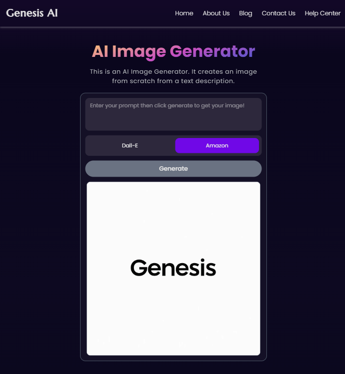

# 🎨 **Genesis-AI** 🎨  

Unleash your imagination with **Genesis-AI**, a state-of-the-art web application that transforms your text prompts into breathtaking AI-generated images. Powered by the **Eden AI API** and built with **React, Tailwind CSS,** and **TypeScript**, Genesis-AI offers a seamless, visually stunning, and intuitive image-generation experience.  


## ✨ **Preview** ✨  

  


## 🚀 **Key Features** 🚀  

- **🔹 AI-Powered Creativity** – Convert your words into mesmerizing visuals using the powerful **Eden AI API**.  
- **🎨 Elegant & Intuitive UI** – Designed with **React** and styled with **Tailwind CSS** for a sleek, fluid, and immersive user experience.  
- **🔧 Type-Safe & Robust** – Built with **TypeScript**, ensuring maintainable, error-resistant code.  
- **⏳ Smooth Loading Experience** – Beautiful, modern **CSS loaders** from [CSSLoaders](https://cssloaders.github.io) enhance user engagement while images are generated.  
- **⚡ Effortless API Integration** – Seamlessly connected with **Eden AI**, ensuring fast and reliable image creation.  


## 🛠️ **Tech Stack** 🛠️  

- **React** – For a dynamic, responsive user interface.  
- **Tailwind CSS** – For modern, utility-first styling.  
- **TypeScript** – Ensuring a type-safe and efficient development process.  
- **Eden AI API** – Powering advanced image generation.  
- **CSS Loaders** – Delivering smooth and visually appealing animations.  


## ⚙️ Installation ⚙️

1.  **Clone the Repository:**

    ```bash
    git clone https://github.com/MohammadAsad-Weber/genesis-ai
    cd Genesis-AI
    ```

2.  **Install Dependencies:**

    ```bash
    npm install
    # or
    yarn install
    # or
    pnpm install
    ```

3.  **Obtain Your Eden AI API Key:**

    - Sign up or log in to your Eden AI account.
    - Retrieve your API key from the Eden AI dashboard.

4.  **Configure `.env` File:**

    - Create a `.env` file in the root directory of your project.
    - Add your Eden AI API key:

      ```
      VITE_API_KEY=YOUR_EDEN_AI_API_KEY
      ```

5.  **Start the Development Server:**

    ```bash
    npm run dev
    # or
    yarn dev
    # or
    pnpm dev
    ```

    Access the application at `http://localhost:5173` (or the port specified by Vite).

## 🎨 Usage 🎨

1.  Open the application in your web browser.
2.  Enter a creative text prompt in the input field.
3.  Click the "Generate" button and watch the magic unfold!
4.  Enjoy your AI-generated masterpiece.

## 🤝 Contributing 🤝

We welcome and encourage contributions! Feel free to submit pull requests with your enhancements.